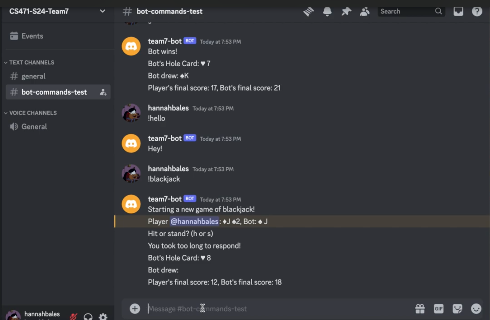
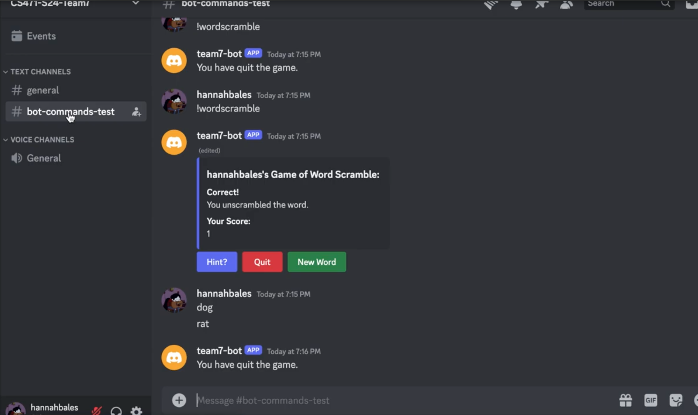

## Boise State University Team Project

Team #7

Hannah Bales

## Discord Bot: Interactive Minigames & Server Commands

A feature-rich Discord bot built with Python and the discord.py library.
Designed to enhance user engagement in a server with fun minigames, custom commands, and helpful documentation all within an agile, team-based development process.

## Features:

Interactive Minigames:

    Blackjack: Play classic blackjack directly in chat (!blackjack)

    Guess The Number: Try to guess the secret number (!guess)

    Trivia Quiz: Test your knowledge with random trivia (!quiz)

    Word Scramble: Unscramble words at different difficulty levels (!wordscramble <difficulty>)

Additional Features:

    Custom Help Command: An embedded help menu with organized command categories (!help)

    Dynamic Cog Loading: Modular code structure for easy feature expansion

    Full Discord Integration: Uses Discord’s embeds and command system

## My Contributions
Developed mini-game logic for both Blackjack and Word Scramble.

Acted as the Product Owner during development.

Assisted with debugging, testing, and GitHub version control.

Wrote documentation and participated in sprint planning.

## Tech Stack

    Language: Python

    Framework / Library: discord.py

    Tools & Services: VS Code, GitHub, dotenv for environment variables

    Version Control: Git & GitHub

## Installation & Setup

Clone the repository:

    git clone <repository-url>
    cd <project-folder>

Install dependencies:

    pip install -r requirements.txt

Add your Discord bot token:

    DISCORD_TOKEN=your_bot_token_here

Run the bot:

    python bot.py

## Demos
Blackjack Mini-game Demo:

Word Scramble Demo:

## License
This project is for educational purposes and not intended for commercial use.